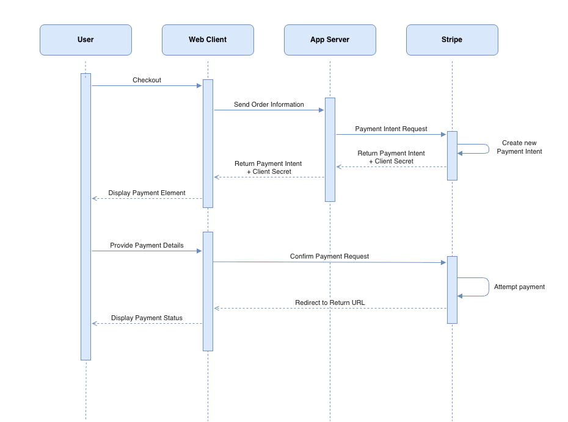

# E-commerce Demo App Using Stripe Elements 

This is a simple e-commerce demo application that a customer can use to purchase a book, using Stripe Elements. This demo uses the more customizable and lower-level PaymentIntents API to charge the customer. 

The demo also serves as sample code for reference. This is not production-ready code. Its main purpose is for developers to understand the core Stripe integrations quickly. 


## Application overview
This demo is written in Python with the [Flask framework](https://flask.palletsprojects.com/) and the [Bootstrap](https://getbootstrap.com/docs/4.6/getting-started/introduction/) CSS framework. 

You'll need to retrieve a set of testmode API keys from the Stripe dashboard (you can create a free test account [here](https://dashboard.stripe.com/register)) to run this locally.

To simplify this project, we're also not using any database here, either. Instead `app.py` includes a simple dictionary and fuction to get for `item`. 

This project has been cloned and then modified based on this [original](https://github.com/marko-stripe/sa-takehome-project-python).


## Stripe Components

Stripe Elements is a set of prebuilt UI components for building a web checkout flow. It’s available as a feature of Stripe.js, a library for building payment flows. Stripe.js tokenizes sensitive payment details within an Element and allows direct payment requests to Stripe without passing through a server. Benefits of Elements are as follows:

- Customizable components - Choose the elements you need and match them to the look and feel of your site 
- Optimized for conversions - Save development time and eliminate user confusion with built-in accessibility, error messages, input masking, autofill, and more
- Unlock new markets - Reach more users with 40+ payment methods through a single integration. Easily run A/B tests and manage payment methods from the Dashboard.
- Help keep payments safe - Stripe’s platform meets industry certification standards to help reduce compliance burdens for your business.

Use the Payment Intents API to build an integration that can handle complex payment flows with a status that changes over the PaymentIntent’s lifecycle. It tracks a payment from creation through checkout, and triggers additional authentication steps when required. Some advantages of using the Payment Intents API include:

- Automatic authentication handling
- No double charges
- Support for Strong Customer Authentication (SCA) and similar regulatory changes

## Application Architecture

<p align="center">

</p>

Note that:
- A client secret is generated by Stripe for each PaymentIntent and passed to the client to use with the Publishable key to authenticate the payment request
- The payment request never goes through the app server, it goes directly from the client to Stripe

## Set Up Instructions
To get started, clone the repository and run pip3 to install dependencies:

```
git clone https://github.com/SonicV2/public-takehome && cd public-takehome
pip3 install -r requirements.txt
```

Rename `sample.env` to `.env` and populate it with your Stripe account's test API keys. Find your Stripe keys in the API Keys section of your [account](https://dashboard.stripe.com/test/apikeys)

Then run the application locally:

```
flask run
```

Navigate to [http://localhost:5000](http://localhost:5000) to view the index page.

<p align="center">

</p>

To test out the workflow of the Stripe API call, purchase a book and check out. Select the card option; PayNow is not yet integrated. 

<p align="center">

</p>

Fill out the test credit card details and your email, and you can find the full list of test [cards](https://stripe.com/docs/testing) here. Below is a sample for fast access. Saving your information for future checkouts is not working at the moment. 

```
Number : 4242424242424242
CVC: Any 3 digits
Expiry Date: Any Future Date

```
## Folder and File Structure
- The flask backend server app is ./app.py. It functions as the web server, rendering web pages and doing the redirects. It makes the actual Payment Intent request to Stripe after receiving the order information from the front end.  
- The frontend scripts (client-side) are stored in the ./public/js folder. The main JS script is custom.js where Elements is initialized and payment confirmation to stripe is made.
- Frontend web pages are stored in the ./views folder. Stripe Elements UI is implemented in ./views/checkout.html. Once payment is completed, users are re-directed to the success page ./views/success.html. 
- All CSS templates are stored in the ./public/css folder with little-to-no modifications. 


 ## Potential improvements 

__App Optimization__

- Webhooks for async payment confirmation. The app currently relies on the redirect for confirmation. On the client, the customer could close the browser window or quit the app before the callback executes, and malicious clients could manipulate the response. Listening for events like payment_intent.succeeded, payment_intent.processing, and payment_intent.payment_failed events rather than waiting for callbacks from the client enables better tracking of the payment lifecycle. 
- Idempotency for retry safety. At the moment, the web client calls certain routes in the app server like /create-payment-intent on page load. If the user refreshes the page, it will create a new payment intent. Having a stateful session for users and using a sessionID for calls will enforce retry safety. 
- Better error handling coverage for both web client and app server. I wrote some error handling while building the app but did not intentionally consider all error cases including edge cases. 

__Safety Improvements__

- Radar rules for fraud detection
- Use a secrets manager to store and retrieve secrets
- Use a restricted API key (Least Privilege)
- Implement TLS for data in transit

__Additional Features__

- Automate tax collection. Calculate and collect the right amount of tax on Stripe transactions
- Save customer information for future purchases
- Implement more payment options like Paynow which is popular in Singapore

## Approach to this assignment

__Learning__  
As I am totally new to Stripe APIs and payment workflows, the first thing to do was to learn about the Payment Intents and Elements. I mostly read through the official documentations and watched a few youtube videos to learn about them. Docs that I read include:     
https://docs.stripe.com/payments/payment-element  
https://docs.stripe.com/payments/payment-intents 

__Planning__     
Visualizing and drawing out the UML diagram allowed me to understand the payment flow really well. Also I referred to a step by step quickstart guide: https://docs.stripe.com/payments/quickstart to understand what needs to be done to set up the basic payment workflow. Looking at the comments in the assignment code also helped with knowing what to implement. My plan was to get the basic payment functionality running first before refining. 

__Implementation and Coding__   
Using the quick guide's sample code as skeleton code really helped me. The sample code was simple and well-explained, it was easy to build on it to achieve the basic payment functionality. Through trial and error, in addition to using Google search and Stackoverflow to help with debugging, I managed to get the basic functionality running. 

__Refining__  
I put on a hat as an evaluator and looked at code quality and the app design as a whole. I edited the code to reflect best practices. I tried to cover as much basic error handling as possible and cleaned up duplicate/dead code. I also referred to Stripe official documentation for best practices. Recommendations like having async confirmations/web hooks were picked up from there. 
Going through this process helped me to write the Potential Improvements section as well. 


## Challenges
My last job was a cloud platform architect for 8 years, which I mostly don't have to deal with front-end code, so my HTML and JS is really rusty. It took me a while to re-familiarize myself, and a good amount of trial and error to get the front-end code right.

Also, I had a hard time deliberating whether to implement some of the potential improvements I have thought of. In the end, I decided to keep it simple as mentioned in the instructions. I believe the assignment intends for the candidate to identify the gaps instead of implementing them. 


